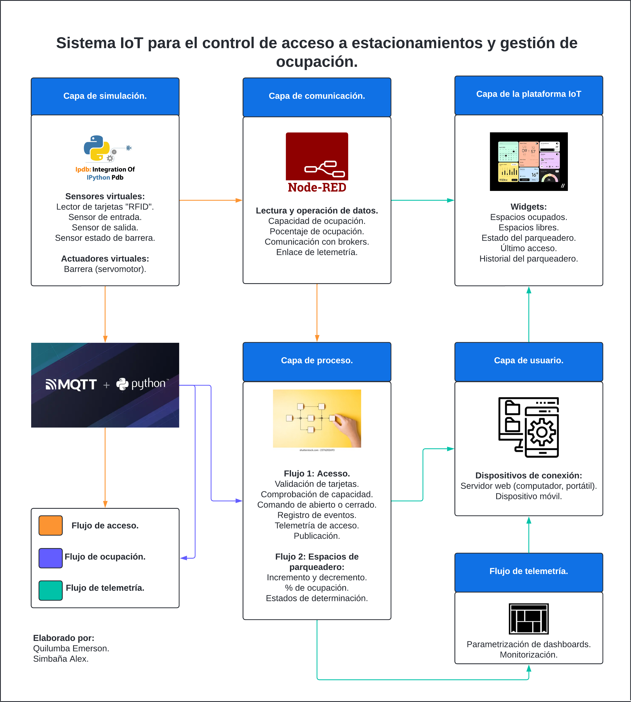
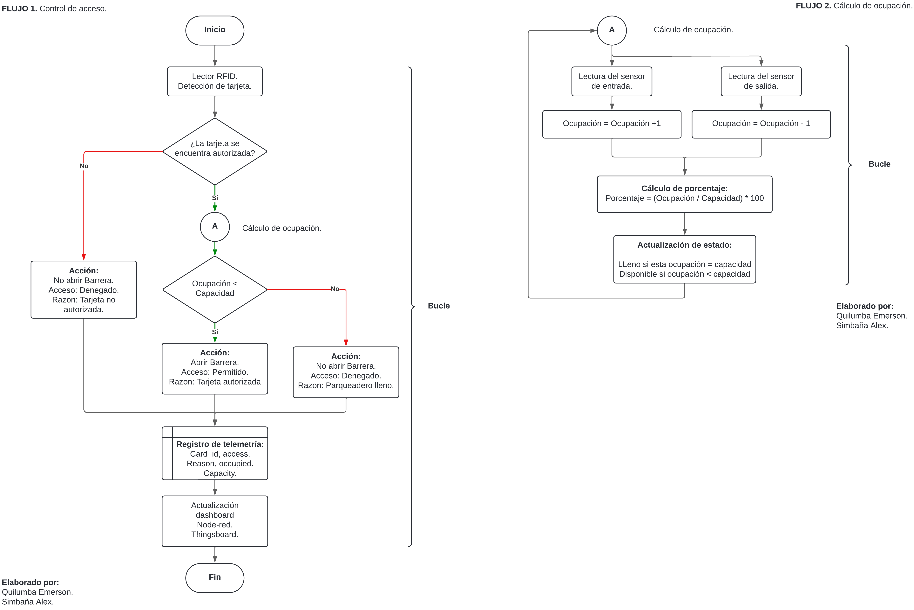
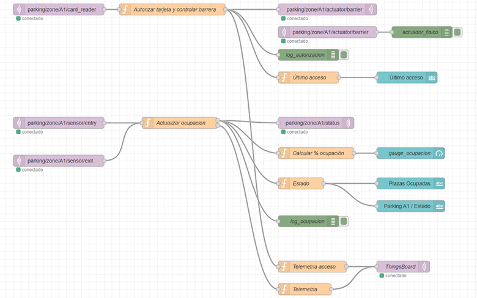
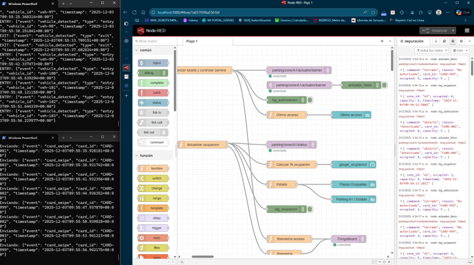
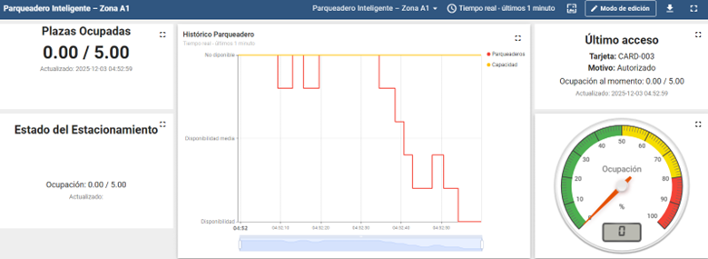
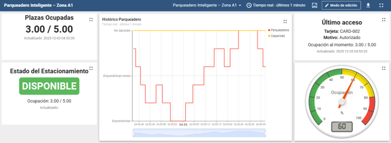
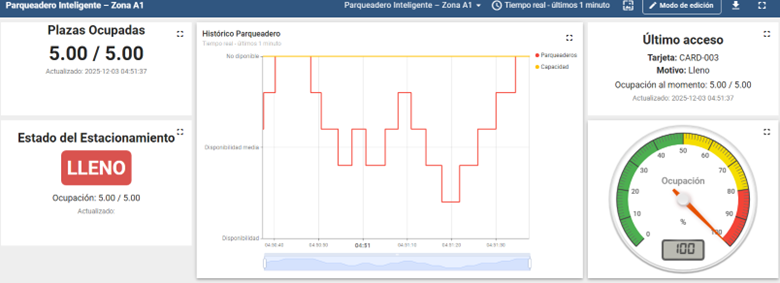

# Sistema IoT para control de acceso y gestión de ocupación en estacionamientos

### Simulación de un estacionamiento inteligente basado en MQTT, Node-RED, Python y ThingsBoard.

---

## 1. Descripción general

Este repositorio contiene la simulación de un sistema IoT para el control de acceso y la gestión de ocupación de un estacionamiento tipo **“Zona A1”**. A partir de sensores y actuadores virtuales (lector RFID, sensores de entrada/salida y barrera), los datos se publican vía MQTT, son orquestados en Node-RED y finalmente se visualizan en un dashboard de ThingsBoard, permitiendo monitorear en tiempo real plazas ocupadas, estado del estacionamiento y último acceso registrado.

---

## 2. Arquitectura de la solución



La arquitectura se organiza en varias capas (simulación, comunicación, proceso, plataforma IoT y usuario), donde **Python + MQTT** generan los eventos, **Node-RED** implementa la lógica de negocio y **ThingsBoard** ofrece el tablero de visualización y análisis, reproduciendo de forma virtual la operación de un parqueadero inteligente.

---

## 3. Flujos de proceso (control de acceso y ocupación)
Los diagramas de flujo describen dos procesos principales:  
- **Flujo 1 – Control de acceso**: valida tarjetas RFID, verifica capacidad disponible y decide la apertura o cierre de la barrera, registrando cada intento de acceso.  
- **Flujo 2 – Cálculo de ocupación**: incrementa/decrementa plazas ocupadas según los sensores de entrada/salida, calcula el porcentaje de ocupación y determina el estado global del estacionamiento (VACÍO, DISPONIBLE, LLENO).
---

## 4. Entorno de simulación

- **Lenguaje principal:** Python 3.x  
- **Mensajería IoT:** MQTT (broker local en `localhost:1883`)  
- **Orquestación y lógica:** Node-RED (flujo `Flujo 1`)  
- **Plataforma IoT / Dashboard:** ThingsBoard (instancia demo `demo.thingsboard.io`)  
- **Visualización local:** Node-RED Dashboard

Los scripts de simulación ejecutan:
- Publicación de lecturas de tarjetas: `sim_card_reader.py`  
- Publicación de entradas y salidas de vehículos: `sim_entry_exit.py`

---
## 5. Lógica principal del sistema

1. **Simulación de eventos (Python + MQTT)**  
   - `sim_card_reader.py` publica mensajes JSON en el tópico  
     `parking/zone/A1/card_reader`:
     ```json
     { "event": "card_swipe", "card_id": "CARD-002", "timestamp": "..." }
     ```
   - `sim_entry_exit.py` publica eventos de entrada y salida en  
     `parking/zone/A1/sensor/entry` y `parking/zone/A1/sensor/exit`:
     ```json
     { "event": "vehicle_detected", "type": "entry", "vehicle_id": "veh-1", "timestamp": "..." }
     ```

2. **Control de acceso en Node-RED**  
   - Nodo **`Autorizar tarjeta y controlar barrera`**:
     - Verifica si `card_id` pertenece al conjunto de tarjetas autorizadas.
     - Lee la ocupación actual desde el contexto (`occupied_A1`).
     - Si la tarjeta es válida **y** `occupied < capacity`, envía al actuador:
       ```json
       { "command": "Abierto", "reason": "Autorizado", ... }
       ```
     - En caso contrario, emite un comando de cierre con el motivo  
       (“Lleno” o “No autorizado”) y construye un log estructurado:
       `card_id`, `access`, `reason`, `occupied`, `capacity`, `timestamp`.

3. **Gestión de ocupación en Node-RED**  
   - Nodo **`Actualizar ocupacion`**:
     - Incrementa o decrementa `occupied_A1` según el tópico (`/entry` o `/exit`).
     - Mantiene la consistencia con una **capacidad fija** (`capacity = 5` en la simulación).
   - Nodo **`Calcular % ocupación`**:
     - Calcula `percent = round(occupied / capacity * 100)` para el gauge.
   - Nodo **`Estado`**:
     - Deriva el estado textual:
       - `VACÍO` si `occupied == 0`
       - `DISPONIBLE` si `0 < occupied < capacity`
       - `LLENO` si `occupied >= capacity`

4. **Telemetría hacia ThingsBoard**  
   - Nodo **`Telemetria`** genera el payload de telemetría consolidada:
     ```json
     {
       "capacity": 5,
       "occupied": 3,
       "percent": 60,
       "status": "DISPONIBLE",
       "card_id": "CARD-002",
       "reason": "tarjeta autorizada",
       "timestamp": 1733200000000
     }
     ```
   - Nodo **`Telemetria acceso`** envía un registro por cada intento de acceso (tarjeta, motivo, ocupación instantánea), alimentando la tabla/histórico de accesos en ThingsBoard.

---

## 6. Métricas y dashboards

Las métricas clave son:

- **capacity**: capacidad máxima de plazas del estacionamiento.  
- **occupied**: plazas ocupadas en tiempo real.  
- **percent**: porcentaje de ocupación calculado sobre la capacidad.  
- **status**: estado lógico del estacionamiento (VACÍO, DISPONIBLE, LLENO).  
- **card_id, reason, access**: trazabilidad de los intentos de acceso.

Estas métricas se visualizan en ThingsBoard mediante:

- Tarjeta HTML de **Plazas Ocupadas** (valor actual `occupied / capacity`).  
- Tarjeta HTML de **Estado del Estacionamiento** (badge verde/rojo según `status`).  
- **Histórico de ocupación** (Time series chart).  
- Tarjeta HTML de **Último acceso** (tarjeta, motivo, ocupación al momento).  
- **Gauge de porcentaje de ocupación** (0–100%).

---

## 7. Capturas principales del sistema

Las siguientes imágenes documentan el funcionamiento de la solución end-to-end:

1. **Arquitectura general del sistema**  
   

2. **Flujo principal para Node-RED**  
   

3. **Simulación en Python – lector de tarjetas - sensores de entrada/salida**  
   

4. **Node-RED con depuración en tiempo real**  
   

5. **Dashboard ThingsBoard – estacionamiento vacío (0 / 5)**  
   

6. **Dashboard ThingsBoard – estacionamiento disponible (3 / 5)**  
   

7. **Dashboard ThingsBoard – estacionamiento lleno (5 / 5)**  
   

---

## 8. Flujo Node-RED

El flujo completo de Node-RED se incluye en este repositorio de dos formas:

- Archivo independiente:  
  `flows/parking_A1_flujo1.json`
- **Apéndice A** al final de este README (JSON completo en bloque de código).

Este flujo contiene todos los nodos de:

- Suscripción a tópicos MQTT (`card_reader`, `sensor/entry`, `sensor/exit`).  
- Lógica de acceso y ocupación.  
- Publicación hacia ThingsBoard.  
- Widgets locales de Node-RED Dashboard.

---

## 9. Cómo importar el flujo en Node-RED

1. Abrir Node-RED en el navegador: `http://localhost:1880`.
2. Menú **≡ → Import → Clipboard**.
3. Copiar el contenido del archivo `flows/parking_A1_flujo1.json` o del  
   **Apéndice A** de este README.
4. Pegar en el recuadro de texto y pulsar **Import**.
5. Verificar que aparezca la pestaña **“Flujo 1”**.
6. Pulsar **Deploy** para activar el flujo.

---

## 10. Cómo ejecutar la simulación completa

1.  En CMD de nuestro computador poner la instrucción node-red

2. **Levantar el broker MQTT local**  
   - Usar Mosquitto u otro broker en `localhost:1883`.
3. **Iniciar Node-RED**  
4. Ejecutar simuladores Python.
'python sim_card_reader.py'
'python sim_entry_exit.py'
Monitorear en Node-RED (pestaña Depuración) la llegada de eventos.
Verificar en ThingsBoard la actualización en tiempo real de métricas y gráficos.
##11. Autores
Este proyecto fue desarrollado como parte de la asignatura

Industria 4.0: Transformación Industrial Digital”, con el objetivo de demostrar una arquitectura IoT aplicable a la gestión inteligente de estacionamientos, integrando simulación de sensores, orquestación de eventos y visualización avanzada en plataforma cloud.

Autores:

Ing. Quilumba Emerson
Ing. Simbaña Alex

Fecha: 05 de diciembre de 2025

## 12. Apéndice A – Flujo Node-RED (JSON completo)

Este bloque reproduce el flujo Flujo 1 para importarlo directamente en Node-RED.
[
    {
        "id": "1a037f396a5561bf",
        "type": "tab",
        "label": "Flujo 1",
        "disabled": false,
        "info": "",
        "env": []
    },
    {
        "id": "dcabec42d4de3fbd",
        "type": "mqtt in",
        "z": "1a037f396a5561bf",
        "name": "",
        "topic": "parking/zone/A1/card_reader",
        "qos": "2",
        "datatype": "json",
        "broker": "df9e46ae65b78436",
        "nl": false,
        "rap": true,
        "rh": 0,
        "inputs": 0,
        "x": 180,
        "y": 100,
        "wires": [
            [
                "b69ab38c4b4f59a9"
            ]
        ]
    },
    {
        "id": "726b2b75a97c7631",
        "type": "mqtt in",
        "z": "1a037f396a5561bf",
        "name": "",
        "topic": "parking/zone/A1/sensor/entry",
        "qos": "2",
        "datatype": "json",
        "broker": "df9e46ae65b78436",
        "nl": false,
        "rap": true,
        "rh": 0,
        "inputs": 0,
        "x": 180,
        "y": 400,
        "wires": [
            [
                "ccfb7d93aa9b6d21"
            ]
        ]
    },
    {
        "id": "400750cfca84528f",
        "type": "mqtt in",
        "z": "1a037f396a5561bf",
        "name": "",
        "topic": "parking/zone/A1/sensor/exit",
        "qos": "2",
        "datatype": "json",
        "broker": "df9e46ae65b78436",
        "nl": false,
        "rap": true,
        "rh": 0,
        "inputs": 0,
        "x": 180,
        "y": 500,
        "wires": [
            [
                "ccfb7d93aa9b6d21"
            ]
        ]
    },
    {
        "id": "f826a0600f0a0293",
        "type": "mqtt out",
        "z": "1a037f396a5561bf",
        "name": "",
        "topic": "parking/zone/A1/actuator/barrier",
        "qos": "0",
        "retain": "",
        "respTopic": "",
        "contentType": "",
        "userProps": "",
        "correl": "",
        "expiry": "",
        "broker": "df9e46ae65b78436",
        "x": 890,
        "y": 100,
        "wires": []
    },
    {
        "id": "5c565774057ff970",
        "type": "debug",
        "z": "1a037f396a5561bf",
        "name": "log_autorizacion",
        "active": true,
        "tosidebar": true,
        "console": false,
        "tostatus": false,
        "complete": "payload",
        "targetType": "msg",
        "statusVal": "",
        "statusType": "auto",
        "x": 840,
        "y": 220,
        "wires": []
    },
    {
        "id": "b69ab38c4b4f59a9",
        "type": "function",
        "z": "1a037f396a5561bf",
        "name": "Autorizar tarjeta y controlar barrera",
        "func": "//Sistema IoT Virtualizado para Control de Acceso y Gestión de Ocupación en Estacionamientos Inteligentes\n//Ing. Quilumba Emerson\n// msg.payload viene del MQTT card_reader como objeto JSON\nlet data = msg.payload;\n\n// Lista de tarjetas autorizadas\nlet autorizadas = [\"CARD-001\", \"CARD-002\", \"CARD-003\"];\n\n// Leer ocupación actual desde el contexto (la que calcula \"Actualizar ocupacion\")\nlet occupied = flow.get(\"occupied_A1\") || 0;\n\n// Debe coincidir con el capacity del otro function\nconst capacity = 5;\n\n// Objeto de log (salida 2)\nlet log = {\n    card_id: data.card_id,\n    timestamp: data.timestamp,\n    event: data.event,\n    occupied: occupied,\n    capacity: capacity\n};\n\nlet salidaBarrera = null;   // saldrá por output 1\nlet salidaLog = null;       // saldrá por output 2\n\nif (autorizadas.includes(data.card_id)) {\n    // Tarjeta válida, ahora revisar capacidad\n    if (occupied < capacity) {\n        // Hay espacio → abrir barrera\n        log.access = \"permitido\";\n        log.reason = \"tarjeta autorizada\";\n\n        salidaBarrera = {\n            payload: {\n                command: \"Abierto\",\n                reason: \"Autorizado\",\n                card_id: data.card_id,\n                occupied: occupied,\n                capacity: capacity,\n                timestamp: data.timestamp\n            }\n        };\n    } else {\n        // Estacionamiento lleno → denegar aunque la tarjeta sea válida\n        log.access = \"Denegado\";\n        log.reason = \"Estacionamiento lleno\";\n\n        salidaBarrera = {\n            payload: {\n                command: \"Cerrado\",\n                reason: \"Lleno\",\n                card_id: data.card_id,\n                occupied: occupied,\n                capacity: capacity,\n                timestamp: data.timestamp\n            }\n        };\n    }\n\n} else {\n    // Tarjeta NO válida\n    log.access = \"Denegado\";\n    log.reason = \"Tarjeta no autorizada\";\n\n    salidaBarrera = {\n        payload: {\n            command: \"Cerrado\",\n            reason: \"No autorizado\",\n            card_id: data.card_id,\n            occupied: occupied,\n            capacity: capacity,\n            timestamp: data.timestamp\n        }\n    };\n}\n\n// Salida 1 → actuador (mqtt out), salida 2 → debug/log\nsalidaLog = { payload: log };\n\nreturn [salidaBarrera, salidaLog];",
        "outputs": 1,
        "timeout": 0,
        "noerr": 0,
        "initialize": "",
        "finalize": "",
        "libs": [],
        "x": 480,
        "y": 100,
        "wires": [
            [
                "f826a0600f0a0293",
                "5c565774057ff970",
                "6fb237cf87e0cbb5",
                "f4b5487b62447b9a"
            ]
        ]
    },
    {
        "id": "bb8f100dc7910fd3",
        "type": "mqtt in",
        "z": "1a037f396a5561bf",
        "name": "",
        "topic": "parking/zone/A1/actuator/barrier",
        "qos": "2",
        "datatype": "auto-detect",
        "broker": "df9e46ae65b78436",
        "nl": false,
        "rap": true,
        "rh": 0,
        "inputs": 0,
        "x": 890,
        "y": 160,
        "wires": [
            [
                "2eca508d52dfda3a"
            ]
        ]
    },
    {
        "id": "2eca508d52dfda3a",
        "type": "debug",
        "z": "1a037f396a5561bf",
        "name": "actuador_fisico",
        "active": true,
        "tosidebar": true,
        "console": false,
        "tostatus": false,
        "complete": "payload",
        "targetType": "msg",
        "statusVal": "",
        "statusType": "auto",
        "x": 1140,
        "y": 160,
        "wires": []
    },
    {
        "id": "ccfb7d93aa9b6d21",
        "type": "function",
        "z": "1a037f396a5561bf",
        "name": "Actualizar ocupacion",
        "func": "//Sistema IoT Virtualizado para Control de Acceso y Gestión de Ocupación en Estacionamientos Inteligentes\n//Ing. Quilumba_Emerson\n// Capacidad máxima del estacionamiento A1\nconst capacity = 5;  // para pruebas, luego puedes subirlo (ej. 50)\n\n// Recuperar ocupación actual desde el contexto\nlet occupied = flow.get(\"occupied_A1\") || 0;\n\n// Identificar si es entrada o salida según el topic\nlet topic = msg.topic;  // ej: \"parking/zone/A1/sensor/entry\"\n\nlet eventType = null;\n\nif (topic.endsWith(\"/entry\")) {\n    eventType = \"entry\";\n    if (occupied < capacity) {\n        occupied += 1;\n    } else {\n        // estacionamiento lleno\n    }\n} else if (topic.endsWith(\"/exit\")) {\n    eventType = \"exit\";\n    if (occupied > 0) {\n        occupied -= 1;\n    }\n}\n\n// Guardar nuevo valor en contexto\nflow.set(\"occupied_A1\", occupied);\n\n// Payload para estado completo (salida 1)\nlet status = {\n    zone_id: \"A1\",\n    occupied: occupied,\n    capacity: capacity,\n    timestamp: new Date().toISOString()\n};\n\n// Payload para log (salida 2)\nlet log = {\n    event: eventType,\n    topic: topic,\n    occupied: occupied,\n    capacity: capacity,\n    timestamp: status.timestamp\n};\n\nreturn [\n    { payload: status },   // salida 1 → mqtt out (status)\n    { payload: log }       // salida 2 → debug\n];\nreturn msg;",
        "outputs": 2,
        "timeout": 0,
        "noerr": 0,
        "initialize": "",
        "finalize": "",
        "libs": [],
        "x": 500,
        "y": 400,
        "wires": [
            [
                "70d0e85b799aa0f8",
                "91a4ccd8b673619a",
                "2a3afcf1c325272d",
                "aa4de4c38df93abb"
            ],
            [
                "e4df0fdbd5965337"
            ]
        ]
    },
    {
        "id": "70d0e85b799aa0f8",
        "type": "mqtt out",
        "z": "1a037f396a5561bf",
        "name": "",
        "topic": "parking/zone/A1/status",
        "qos": "",
        "retain": "",
        "respTopic": "",
        "contentType": "",
        "userProps": "",
        "correl": "",
        "expiry": "",
        "broker": "df9e46ae65b78436",
        "x": 860,
        "y": 400,
        "wires": []
    },
    {
        "id": "aa4de4c38df93abb",
        "type": "debug",
        "z": "1a037f396a5561bf",
        "name": "log_ocupacion",
        "active": true,
        "tosidebar": true,
        "console": false,
        "tostatus": false,
        "complete": "payload",
        "targetType": "msg",
        "statusVal": "",
        "statusType": "auto",
        "x": 840,
        "y": 660,
        "wires": []
    },
    {
        "id": "abc9864b48c01ca3",
        "type": "ui_gauge",
        "z": "1a037f396a5561bf",
        "name": "gauge_ocupacion",
        "group": "6dfd5ae095f51332",
        "order": 0,
        "width": 0,
        "height": 0,
        "gtype": "gage",
        "title": "Ocupación",
        "label": "units",
        "format": "{{value}}%",
        "min": 0,
        "max": "100",
        "colors": [
            "#00b500",
            "#e6e600",
            "#ca3838"
        ],
        "seg1": "",
        "seg2": "",
        "diff": false,
        "className": "",
        "x": 1110,
        "y": 480,
        "wires": []
    },
    {
        "id": "91a4ccd8b673619a",
        "type": "function",
        "z": "1a037f396a5561bf",
        "name": "Calcular % ocupación",
        "func": "//Sistema IoT Virtualizado para Control de Acceso y Gestión de Ocupación en Estacionamientos Inteligentes\n//Ing. Quilumba Emerson\n// msg.payload viene de \"Actualizar ocupacion\": { zone_id, occupied, capacity, ... }\nlet o = msg.payload.occupied || 0;\nlet c = msg.payload.capacity || 1;\n\nlet pct = Math.round((o / c) * 100);\n\nmsg.payload = pct;  // el gauge espera un número en msg.payload\nreturn msg;\n\nreturn msg;",
        "outputs": 1,
        "timeout": 0,
        "noerr": 0,
        "initialize": "",
        "finalize": "",
        "libs": [],
        "x": 860,
        "y": 480,
        "wires": [
            [
                "abc9864b48c01ca3"
            ]
        ]
    },
    {
        "id": "6f9bdba1b9b6dfbb",
        "type": "ui_text",
        "z": "1a037f396a5561bf",
        "group": "6dfd5ae095f51332",
        "order": 1,
        "width": 0,
        "height": 0,
        "name": "",
        "label": "Plazas Ocupadas",
        "format": "{{msg.occupied}} / {{msg.capacity}}",
        "layout": "row-spread",
        "className": "",
        "style": false,
        "font": "",
        "fontSize": 16,
        "color": "#000000",
        "x": 1110,
        "y": 560,
        "wires": []
    },
    {
        "id": "a8c3a9f759d9c65b",
        "type": "ui_text",
        "z": "1a037f396a5561bf",
        "group": "6dfd5ae095f51332",
        "order": 2,
        "width": 0,
        "height": 0,
        "name": "",
        "label": "Parking A1 / Estado",
        "format": "{{msg.status}}",
        "layout": "row-spread",
        "className": "",
        "style": false,
        "font": "",
        "fontSize": 16,
        "color": "#000000",
        "x": 1110,
        "y": 620,
        "wires": []
    },
    {
        "id": "2a3afcf1c325272d",
        "type": "function",
        "z": "1a037f396a5561bf",
        "name": "Estado",
        "func": "let o = msg.payload.occupied;\nlet c = msg.payload.capacity;\n\nlet status = \"Disponible\";\nif (o >= c) status = \"LLENO\";\nelse if (o === 0) status = \"Vacío\";\n\nmsg.occupied = o;\nmsg.capacity = c;\nmsg.status = status;\n\nreturn msg;\n",
        "outputs": 1,
        "timeout": 0,
        "noerr": 0,
        "initialize": "",
        "finalize": "",
        "libs": [],
        "x": 820,
        "y": 560,
        "wires": [
            [
                "6f9bdba1b9b6dfbb",
                "a8c3a9f759d9c65b"
            ]
        ]
    },
    {
        "id": "d634ad0263437ecd",
        "type": "ui_text",
        "z": "1a037f396a5561bf",
        "group": "6dfd5ae095f51332",
        "order": 3,
        "width": 0,
        "height": 0,
        "name": "",
        "label": "Último acceso",
        "format": "{{msg.text}}",
        "layout": "row-spread",
        "className": "",
        "style": false,
        "font": "",
        "fontSize": 16,
        "color": "#000000",
        "x": 1100,
        "y": 280,
        "wires": []
    },
    {
        "id": "6fb237cf87e0cbb5",
        "type": "function",
        "z": "1a037f396a5561bf",
        "name": "Último acceso",
        "func": "//Sistema IoT Virtualizado para Control de Acceso y Gestión de Ocupación en Estacionamientos Inteligentes\n//Ing. Quilumba Emerson\nlet log = msg.payload;\n\n// Por si llega como string\nif (typeof log === \"string\") {\n    try { log = JSON.parse(log); } catch (e) { }\n}\n\nlet card = log.card_id || \"N/A\";\nlet access = log.access || \"Permitido\";\nlet reason = log.reason || \"\";\nlet occ = log.occupied;\nlet cap = log.capacity;\n\nmsg.text = `Tarjeta: ${card} | Acceso: ${access} | Motivo: ${reason} | Ocupado: ${occ}/${cap}`;\n\nreturn msg;\n",
        "outputs": 1,
        "timeout": 0,
        "noerr": 0,
        "initialize": "",
        "finalize": "",
        "libs": [],
        "x": 840,
        "y": 280,
        "wires": [
            [
                "d634ad0263437ecd"
            ]
        ]
    },
    {
        "id": "3ab8eb7a7f4c2da4",
        "type": "mqtt out",
        "z": "1a037f396a5561bf",
        "name": "ThingsBoard",
        "topic": "v1/devices/me/telemetry",
        "qos": "2",
        "retain": "",
        "respTopic": "",
        "contentType": "",
        "userProps": "",
        "correl": "",
        "expiry": "",
        "broker": "715aa3f6ade5235a",
        "x": 1090,
        "y": 780,
        "wires": []
    },
    {
        "id": "e4df0fdbd5965337",
        "type": "function",
        "z": "1a037f396a5561bf",
        "name": "Telemetria",
        "func": "// Sistema IoT Virtualizado para Control de Acceso y Gestión de Ocupación en Estacionamientos Inteligentes\n// Ing. Quilumba Emerson\n\nlet p = msg.payload || {};\n\n// 1) Tomamos ocupación y capacidad, del mensaje o del contexto\nlet occupied = (p.occupied !== undefined) ? p.occupied : (flow.get(\"occupied_A1\") || 0);\nlet capacity = (p.capacity !== undefined) ? p.capacity : (flow.get(\"capacity_A1\") || 5);\n\n// 2) Calculamos porcentaje\nlet percent = capacity > 0 ? Math.round((occupied / capacity) * 100) : 0;\n\n// 3) Calculamos el status AQUÍ (el mismo criterio que en \"Estado\")\nlet status;\nif (occupied >= capacity) {\n    status = \"LLENO\";\n} else if (occupied === 0) {\n    status = \"VACÍO\";\n} else {\n    status = \"DISPONIBLE\";\n}\n\n// 4) Construimos la telemetría que ThingsBoard recibirá\nmsg.payload = {\n    capacity: capacity,\n    occupied: occupied,\n    percent: percent,\n    status: status,          // <- ahora SIEMPRE coherente con occupied/capacity\n    card_id: p.card_id,\n    access: p.access,        // si lo usas en otros widgets\n    reason: p.reason,\n    timestamp: p.timestamp || Date.now()\n};\n\nreturn msg;\n",
        "outputs": 1,
        "timeout": 0,
        "noerr": 0,
        "initialize": "",
        "finalize": "",
        "libs": [],
        "x": 830,
        "y": 840,
        "wires": [
            [
                "3ab8eb7a7f4c2da4"
            ]
        ]
    },
    {
        "id": "f4b5487b62447b9a",
        "type": "function",
        "z": "1a037f396a5561bf",
        "name": "Telemetria acceso",
        "func": "//Sistema IoT Virtualizado para Control de Acceso y Gestión de Ocupación en Estacionamientos Inteligentes\n//Ing. Quilumba Emerson\n// Telemetría SOLO de accesos (histórico)\n// Se ejecuta cada vez que se procesa una tarjeta\n\nlet p = msg.payload || {};\n\n// Leemos ocupación y capacidad actuales desde el contexto\nlet occupied = flow.get(\"occupied_A1\") || 0;\nlet capacity = flow.get(\"capacity_A1\") || 5;\n\n// Construimos el registro de acceso\nmsg.payload = {\n    card_id: p.card_id,                   // tarjeta usada\n    reason: p.reason,                    // Autorizado / Lleno / No autorizado...\n    access: p.access,                    // Permitido / Denegado (si lo usas)\n    occupied: occupied,                    // plazas ocupadas justo en ese momento\n    capacity: capacity,                    // capacidad total\n    timestamp: p.timestamp || Date.now()    // momento del acceso\n};\n\nreturn msg;\n",
        "outputs": 1,
        "timeout": 0,
        "noerr": 0,
        "initialize": "",
        "finalize": "",
        "libs": [],
        "x": 850,
        "y": 780,
        "wires": [
            [
                "3ab8eb7a7f4c2da4"
            ]
        ]
    },
    {
        "id": "df9e46ae65b78436",
        "type": "mqtt-broker",
        "name": "PruebaLocal",
        "broker": "localhost",
        "port": 1883,
        "clientid": "",
        "autoConnect": true,
        "usetls": false,
        "protocolVersion": 4,
        "keepalive": 60,
        "cleansession": true,
        "autoUnsubscribe": true,
        "birthTopic": "",
        "birthQos": "0",
        "birthRetain": "false",
        "birthPayload": "",
        "birthMsg": {},
        "closeTopic": "",
        "closeQos": "0",
        "closeRetain": "false",
        "closePayload": "",
        "closeMsg": {},
        "willTopic": "",
        "willQos": "0",
        "willRetain": "false",
        "willPayload": "",
        "willMsg": {},
        "userProps": "",
        "sessionExpiry": ""
    },
    {
        "id": "6dfd5ae095f51332",
        "type": "ui_group",
        "name": "Estado",
        "tab": "3631e0d68a7ffac6",
        "order": 1,
        "disp": true,
        "width": 6,
        "collapse": false,
        "className": ""
    },
    {
        "id": "715aa3f6ade5235a",
        "type": "mqtt-broker",
        "name": "ThingsBoard",
        "broker": "demo.thingsboard.io",
        "port": 1883,
        "clientid": "",
        "autoConnect": true,
        "usetls": false,
        "protocolVersion": 4,
        "keepalive": 60,
        "cleansession": true,
        "autoUnsubscribe": true,
        "birthTopic": "",
        "birthQos": "0",
        "birthRetain": "false",
        "birthPayload": "",
        "birthMsg": {},
        "closeTopic": "",
        "closeQos": "0",
        "closeRetain": "false",
        "closePayload": "",
        "closeMsg": {},
        "willTopic": "",
        "willQos": "0",
        "willRetain": "false",
        "willPayload": "",
        "willMsg": {},
        "userProps": "",
        "sessionExpiry": ""
    },
    {
        "id": "3631e0d68a7ffac6",
        "type": "ui_tab",
        "name": "Parking A1",
        "icon": "dashboard",
        "order": 4,
        "disabled": false,
        "hidden": false
    },
    {
        "id": "af509f539358c3de",
        "type": "global-config",
        "env": [],
        "modules": {
            "node-red-dashboard": "3.6.6"
        }
    }
]

